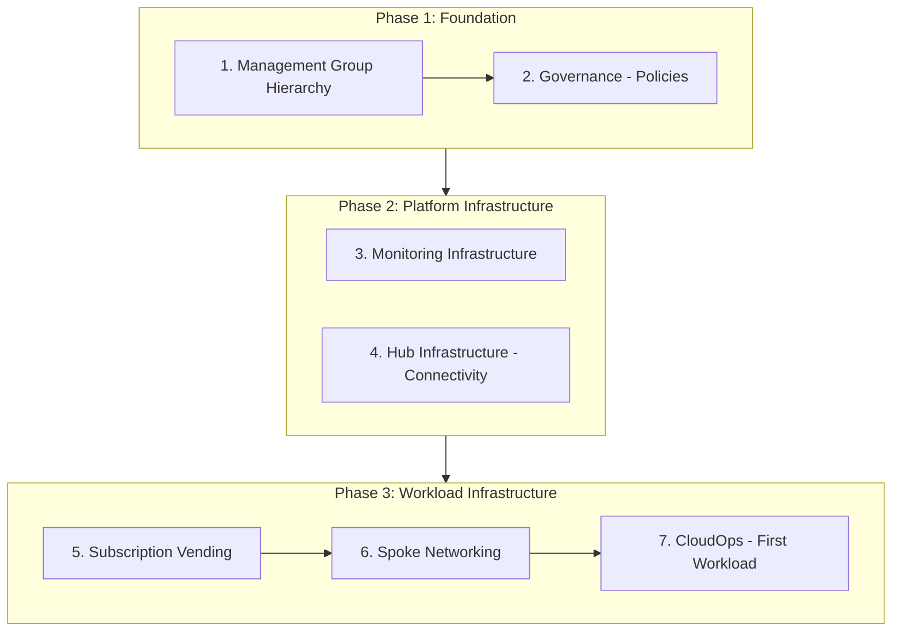

# Azure Build Foundation Overview

This documentation provides a complete guide to deploying and managing an Azure Landing Zone foundation using Bicep templates and Azure DevOps pipelines. The infrastructure follows Azure Cloud Adoption Framework (CAF) patterns and leverages Azure Verified Modules (AVM) where available.

## Deployment Order of Operations

The deployment follows a specific sequence to ensure dependencies are met. Each phase builds upon the previous one.



---

## Phase 1: Foundation

Establish the organizational structure and governance baseline for your Azure environment.

### Step 1: Management Group Hierarchy

**Purpose**: Create the management group structure that organizes subscriptions and enables centralized governance.

| Item | Details |
|------|---------|
| **Pipeline** | `mg-hierarchy-pipeline.yaml` |
| **Scope** | Tenant |
| **Prerequisites** | Service Principal with Tenant Root permissions |
| **Output** | Management group hierarchy (Platform, Landing Zone, Sandbox, Decommissioned) |

**What Gets Created**:
- Organization root management group
- Platform management groups (Management, Connectivity)
- Landing Zone management groups (Corp/Online, Prod/Non-Prod)
- Sandbox and Decommissioned management groups

📖 **Documentation**: [Management Group Hierarchy](Management-Group-Hierarchy.md)

---

### Step 2: Governance (Policies)

**Purpose**: Deploy Azure Policies in audit mode for compliance reporting and security visibility across the management group hierarchy.

| Item | Details |
|------|---------|
| **Pipeline** | `governance-pipeline.yaml` |
| **Scope** | Management Group |
| **Prerequisites** | Step 1 completed |
| **Output** | Policy assignments (MCSB, Canada PBMM) in audit mode |

**What Gets Created**:
- Microsoft Cloud Security Benchmark (MCSB) policy assignment (audit mode)
- Canada Federal PBMM policy assignment (audit mode)

> **Note:** Policies are deployed in audit mode and are intended to remain that way. Use compliance data to identify gaps, then remediate through IaC pipelines. This keeps infrastructure changes centralized and prevents drift.

📖 **Documentation**: [Governance](Governance.md)

---

## Phase 2: Platform Infrastructure

Deploy the core platform services that support all workloads.

> **Note**: Platform subscriptions (Management, Connectivity) must exist before deploying these components. Create them manually or use Subscription Vending first if needed.

### Step 3: Monitoring Infrastructure

**Purpose**: Deploy centralized monitoring and logging infrastructure in the Management subscription.

| Item | Details |
|------|---------|
| **Pipeline** | `monitoring-pipeline.yaml` |
| **Scope** | Management Subscription |
| **Prerequisites** | Management subscription exists |
| **Output** | Log Analytics workspace, diagnostic settings |

**What Gets Created**:
- Log Analytics workspace (central log repository)
- Resource group for monitoring resources
- Deployment Stack for resource protection

📖 **Documentation**: [Monitoring Infrastructure](Monitoring-Infrastructure.md)

---

### Step 4: Hub Infrastructure

**Purpose**: Deploy the hub networking infrastructure in the Connectivity subscription, including virtual network, AVNM, and optional security components.

| Item | Details |
|------|---------|
| **Pipeline** | `hub-pipeline.yaml` |
| **Scope** | Connectivity Subscription |
| **Prerequisites** | Steps 1-3 completed, Connectivity subscription exists |
| **Output** | Hub VNet, AVNM, Private DNS Zone, optional Firewall/Gateway |

**What Gets Created**:
- Hub Virtual Network with subnets
- Azure Virtual Network Manager (AVNM) for hub-spoke connectivity
- Private DNS Zone for internal resolution
- Network Watcher
- IPAM Pool (optional) for centralized IP management
- Optional: Azure Firewall, Application Gateway, VPN Gateway, DDoS Protection

📖 **Documentation**: [Hub Infrastructure](Hub-Infrastructure.md)

---

## Phase 3: Workload Infrastructure

Deploy workload subscriptions, spoke networks, and the first operational workload.

### Step 5: Subscription Vending

**Purpose**: Automate the creation of new Azure subscriptions with consistent naming, tagging, and management group placement.

| Item | Details |
|------|---------|
| **Pipeline** | `sub-vending-pipeline.yaml` |
| **Scope** | Tenant/Management Group |
| **Prerequisites** | Step 1 completed, billing permissions configured |
| **Output** | New subscription in the appropriate management group |

**What Gets Created**:
- New Azure subscription
- Subscription tags
- Management group assignment

**Use This When**:
- Creating a new workload subscription (Corp/Online)
- Creating a CloudOps subscription
- Creating any new subscription that needs to follow standards

📖 **Documentation**: [Subscription Vending](Subscription-Vending.md)

---

### Step 6: Spoke Networking

**Purpose**: Deploy spoke virtual networks for workload subscriptions, automatically connected to the hub via AVNM.

| Item | Details |
|------|---------|
| **Pipeline** | `spoke-networking-pipeline.yaml` |
| **Scope** | Workload Subscription |
| **Prerequisites** | Steps 4-5 completed (Hub exists, spoke subscription exists) |
| **Output** | Spoke VNet connected to hub, Private DNS Zone link |

**What Gets Created**:
- Spoke Virtual Network
- AVNM automatic connectivity to hub
- Private DNS Zone link to hub DNS
- IPAM static CIDR allocation (optional)
- Deployment Stack for resource protection

📖 **Documentation**: [Spoke Infrastructure](Spoke-Infrastructure.md)

---

### Step 7: CloudOps (First Workload)

**Purpose**: Deploy the CloudOps infrastructure including Managed DevOps Pools for Azure DevOps agents with private networking.

| Item | Details |
|------|---------|
| **Pipeline** | `cloudops-devcenter-pipeline.yaml` then `cloudops-pipeline.yaml` |
| **Scope** | CloudOps Subscription |
| **Prerequisites** | Steps 5-6 completed for CloudOps subscription |
| **Output** | Managed DevOps Pool with hub-spoke connectivity |

**What Gets Created**:
- DevCenter infrastructure
- Managed DevOps Pool (Azure DevOps agents)
- Private network connectivity via AVNM

**Why CloudOps First?**:
- Enables private infrastructure deployment for subsequent workloads
- Agents have line-of-sight to hub and all spokes via AVNM
- Native scale-to-zero reduces costs when not in use

📖 **Documentation**: [CloudOps](CloudOps.md)

---

## Prerequisites Checklist

Before starting deployment, ensure you have:

- [ ] **Azure AD Tenant** with appropriate permissions
- [ ] **Azure DevOps Organization** and project configured
- [ ] **Service Principal** created for pipeline authentication
- [ ] **RBAC Permissions** assigned to service principal ([RBAC Requirements](RBAC-Requirements.md))
- [ ] **Billing Permissions** for subscription creation (if using sub-vending)
- [ ] **Variable Groups** configured in Azure DevOps

### Service Principal Quick Setup

For initial deployment, assign Owner at Tenant Root Management Group:

```bash
SP_OBJECT_ID="<your-service-principal-object-id>"
TENANT_ROOT_MG=$(az account management-group list --query "[?displayName=='Tenant Root Group'].name" -o tsv)

az role assignment create \
  --assignee "$SP_OBJECT_ID" \
  --role "Owner" \
  --scope "/providers/Microsoft.Management/managementGroups/$TENANT_ROOT_MG"
```

See [RBAC Requirements](RBAC-Requirements.md) for detailed per-pipeline permissions.

---

## Component Dependencies

| Component | Depends On |
|-----------|------------|
| Management Group Hierarchy | — |
| Governance | Management Group Hierarchy |
| Monitoring Infrastructure | Management Subscription |
| Hub Infrastructure | Monitoring Infrastructure |
| Subscription Vending | Management Group Hierarchy |
| Spoke Networking | Hub Infrastructure, Target Subscription |
| CloudOps | Spoke Networking (CloudOps spoke) |

---

## Quick Reference: Pipelines

| Pipeline | Purpose | Scope |
|----------|---------|-------|
| `mg-hierarchy-pipeline.yaml` | Management group hierarchy | Tenant |
| `governance-pipeline.yaml` | Policy assignments | Management Group |
| `monitoring-pipeline.yaml` | Log Analytics workspace | Subscription |
| `hub-pipeline.yaml` | Hub networking | Subscription |
| `sub-vending-pipeline.yaml` | Subscription creation | Tenant |
| `spoke-networking-pipeline.yaml` | Spoke networking | Subscription |
| `cloudops-devcenter-pipeline.yaml` | DevCenter setup | Subscription |
| `cloudops-pipeline.yaml` | Managed DevOps Pool | Subscription |

---

## Documentation Index

### Foundation
- [Management Group Hierarchy](Management-Group-Hierarchy.md) - Structure and governance hierarchy
- [Governance](Governance.md) - Azure Policy assignments for compliance and security

### Platform Infrastructure
- [Monitoring Infrastructure](Monitoring-Infrastructure.md) - Centralized logging and monitoring
- [Hub Infrastructure](Hub-Infrastructure.md) - Hub networking and connectivity

### Workload Infrastructure
- [Subscription Vending](Subscription-Vending.md) - Automated subscription provisioning
- [Spoke Infrastructure](Spoke-Infrastructure.md) - Spoke networking for workloads
- [CloudOps](CloudOps.md) - DevOps agents and operational tooling

### Reference
- [RBAC Requirements](RBAC-Requirements.md) - Service principal permissions guide
