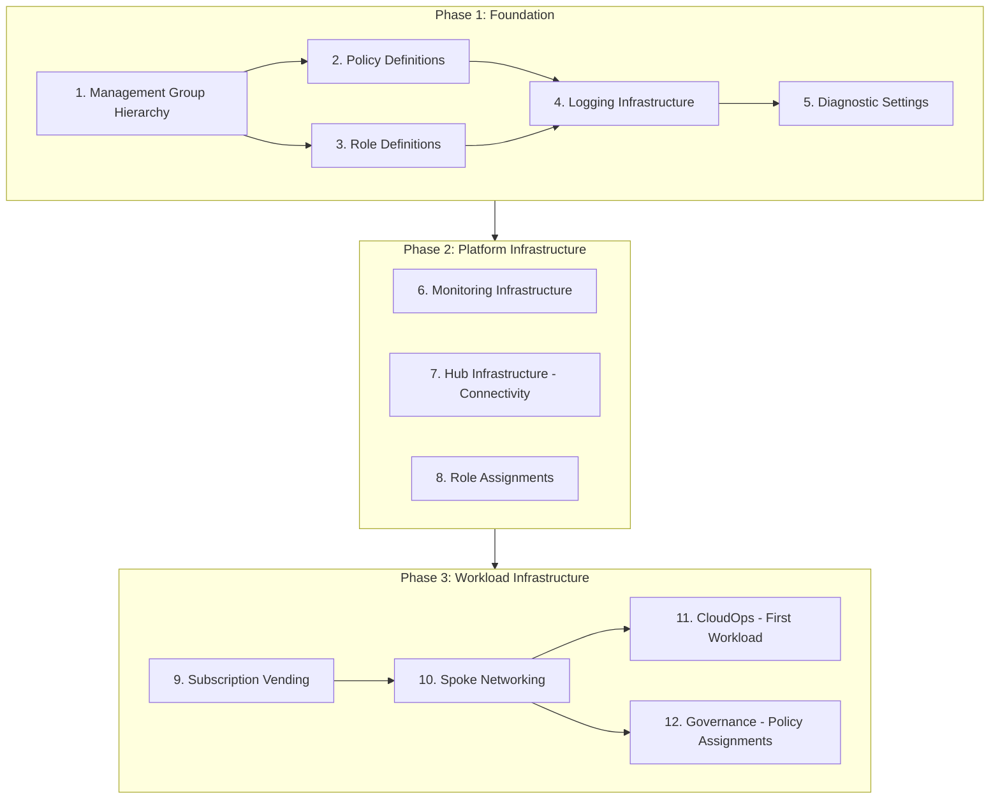

# Azure Build Foundation Overview

This documentation provides a complete guide to deploying and managing an Azure Landing Zone foundation using Bicep templates and Azure DevOps pipelines. The infrastructure follows Azure Cloud Adoption Framework (CAF) patterns and leverages Azure Verified Modules (AVM) where available.

## Deployment Order of Operations

The deployment follows a specific sequence to ensure dependencies are met. Each phase builds upon the previous one.

---

## Phase 1: Foundation

Establish the organizational structure and governance baseline.

### Step 1: Management Group Hierarchy
**Purpose**: Create the management group structure that organizes subscriptions.
- **Pipeline**: `mg-hierarchy-pipeline.yaml`
- **Docs**: [Management Group Hierarchy](Management-Group-Hierarchy.md)

### Step 2: Policy Definitions
**Purpose**: Publish custom Azure Policy Definitions to the intermediate root Management Group.
- **Pipeline**: `policy-definitions-pipeline.yaml`
- **Output**: Custom Policy Definitions available for assignment.

### Step 3: Role Definitions
**Purpose**: Publish custom RBAC Role Definitions (e.g., "Network Operations") to the hierarchy.
- **Pipeline**: `role-definitions-pipeline.yaml`
- **Output**: Custom Role Definitions available for assignment.

### Step 4: Logging Infrastructure
**Purpose**: Deploy the central Log Analytics Workspace and Automation Account.
- **Pipeline**: `logging-pipeline.yaml`
- **Docs**: [Logging Infrastructure](Logging-Infrastructure.md)

### Step 5: Management Group Diagnostic Settings
**Purpose**: Configure Management Groups to send Activity Logs to the central workspace.
- **Pipeline**: `mg-diag-settings-pipeline.yaml`
- **Docs**: [Diagnostic Settings](Management-Group-Diagnostic-Settings.md)

---

## Phase 2: Platform Infrastructure

Deploy core services and access controls.

### Step 6: Monitoring Infrastructure
**Purpose**: Deploy Action Groups and Alert Rules to monitor the platform.
- **Pipeline**: `monitoring-pipeline.yaml`
- **Docs**: [Monitoring Infrastructure](Monitoring-Infrastructure.md)

### Step 7: Hub Infrastructure
**Purpose**: Deploy hub networking (VNet, Firewall, Gateway) and AVNM.
- **Pipeline**: `hub-pipeline.yaml`
- **Docs**: [Hub Infrastructure](Hub-Infrastructure.md)

### Step 8: Role Assignments
**Purpose**: Grant access (RBAC) to users/groups across the hierarchy.
- **Pipeline**: `role-assignments-pipeline.yaml`
- **Docs**: [Role Assignments](Role-Assignments.md)

---

## Phase 3: Workload Infrastructure

Deploy workloads and enforce governance.

### Step 9: Subscription Vending
**Purpose**: Automate subscription creation and placement.
- **Pipeline**: `sub-vending-pipeline.yaml`
- **Docs**: [Subscription Vending](Subscription-Vending.md)

### Step 10: Spoke Networking
**Purpose**: Deploy spoke VNets and connect them to the Hub.
- **Pipeline**: `spoke-networking-pipeline.yaml`
- **Docs**: [Spoke Infrastructure](Spoke-Infrastructure.md)

### Step 11: CloudOps (First Workload)
**Purpose**: Deploy DevOps agents and operational tooling.
- **Pipeline**: `cloudops-pipeline.yaml`
- **Docs**: [CloudOps](CloudOps.md)

### Step 12: Governance (Policy Assignments)
**Purpose**: Assign policies (MCSB, PBMM) to Management Groups.
- **Pipeline**: `governance-pipeline.yaml`
- **Docs**: [Governance](Governance.md)

---

## Documentation Index

### Core Components
- [Logging Infrastructure](Logging-Infrastructure.md)
- [Management Group Diagnostic Settings](Management-Group-Diagnostic-Settings.md)
- [Role Assignments](Role-Assignments.md)
- [Monitoring Infrastructure](Monitoring-Infrastructure.md)

### Networking
- [Hub Infrastructure](Hub-Infrastructure.md)
- [Spoke Infrastructure](Spoke-Infrastructure.md)

### Governance
- [Management Group Hierarchy](Management-Group-Hierarchy.md)
- [Governance](Governance.md) (Policy Assignments)

### Operations
- [Subscription Vending](Subscription-Vending.md)
- [CloudOps](CloudOps.md)
- [RBAC Requirements](RBAC-Requirements.md)
